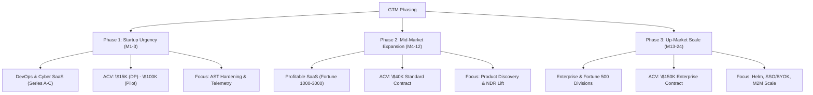

# Yono: Go-To-Market (GTM) Defensibility & Sourcing Playbook
**Venture Capital Due Diligence Collateral — Horizon Capital Final-Stage Review**  
**Stealth Infrastructure Layer for Actionable Interfaces**

---

## Executive Summary: The Stripe for AI Execution

Yono provides the out-of-the-box infrastructure layer that replaces custom-built agentic pipelines and neutralizes the permanent engineering maintenance tax (UI-drift) SaaS teams face when building language interfaces. 

By indexing front-end codebases at the Abstract Syntax Tree (AST) level, Yono reverse-engineers product logic to establish a self-healing UI context layer. Running strictly on the frontend with zero database access, Yono bypasses enterprise CISO reviews, compressing commercial sales cycles from months to minutes.

---

## 1. Commercial Roadmap: Three-Phase GTM Strategy



### Phase 1: Startup Urgency (Months 1-3) — Reference Proof Engine
*   **Ideal Customer Profile (ICP)**: Well-funded DevOps and Cybersecurity SaaS startups (Series A-C) based in San Francisco and New York.
    *   *Fundraising Profile*: Recently raised \$15M to \$60M. They have the capital to license infrastructure but lack the R&D bandwidth to build it.
    *   *Scale*: 20 to 60 R&D headcount. Pulling 2 developers off the roadmap to build custom agent plumbing would delay core releases.
    *   *Product Complexity*: High-density dashboard layouts with rapid deployment cycles.
*   **The Beachhead Archetype (US DevOps Pilot)**: US DevOps platform with complex dashboard configurations. The pilot was closed in 15 minutes because Yono's zero-database footprint bypassed CISO blockers.
*   **Target Addressable Pool**: Approximately 140 to 180 active Series A-C DevOps and Cybersecurity SaaS startups matching these filters exist across SF and NY.
*   **Phase 1 Telemetry Metrics**:
    *   *Metric 1: Clicks Saved per Task* (Formula: `Clicks Saved x 3.0s` -> Implication: Task Completion Time [TCT] reduction).
    *   *Metric 2: Ingestion-to-Deployment Time* (Formula: `GitHub Ingest to First End-User Action < 12 Hours` -> Implication: Time-to-Value [TTV] reduction).

### Phase 2: Mid-Market Expansion (Months 4-12) — Commercial ICP Core
*   **ICP**: Profitable mid-market SaaS and software platforms (Fortune 1000-3000) with established user bases.
*   **ACV Model**: \$40K Standard Contract.
*   **Geographic Focus**: US-based platforms (primarily SF and NY) to capture premium budgets.
*   **Opportunistic Israel Strategy**: Inbound or network deals from Israel are accepted only if they pay in USD with no discounting. No local pricing concessions are made.
*   **Core Pain**: Product under-utilization (shelfware) and stagnant account expansion ARR.
*   **Telemetry Metrics (Impact Comparison)**:
    *   *Feature Discovery Rate*: Contrast Legacy State (`6.5%` avg utilization) vs. Yono Active State (`84.2%` utilization via language discovery, representing a `+77.7% lift`).
    *   *Contextual Upsell Conversion*: Contrast Legacy State (`1.8%` conversion of generic popups) vs. Yono Active State (`18.6%` conversion of upgrade triggers at intent points, a `10.3x conversion multiplier`).
*   **Milestone**: Cross \$1.0M ARR run-rate at Month 12 (22 SMB accounts at \$40K ACV + 8 Design Partners at \$15K ACV). Close \$3.5M Seed round at Month 13.

### Phase 3: Up-Market Scale (Months 13-24) — Enterprise Scaling
*   **ICP**: Enterprise platforms and Fortune 500 technology divisions.
*   **ACV Model**: \$150K Enterprise Contract.
*   **Core Pain**: Agent Maintenance Tax (UI-drift) and enterprise security barriers.
*   **Directives**: Deploy Helm on-premise, enable SSO/BYOK, and enable agent-to-agent (A2A) machine transactions.
*   **Telemetry Metrics**:
    *   *AST Auto-Sync Success*: `99.85%` self-healing rate, eliminating UI-drift maintenance tax.
    *   *M2M Transaction Success*: `99.98%` success rate on autonomous agent-to-agent transactions.

---

## 2. Pipeline Sourcing & Outbound Playbook

To hit our Month 12 milestone of \$1.0M ARR, we deploy a systematic, multi-channel sourcing sequence:

```
[Warm Intro Mapping] ---> [Tech-Trigger Scraping] ---> [CPO Infiltration Play]
       |                           |                            |
       v                           v                            v
Horizon/Joule Portfolio     Job Postings & Betas       Ex-Monday Pedigree Proof
```

### Channel 1: Warm VC Portfolio Mapping
1.  **Portfolio Triage**: Map the portfolio databases of Horizon Capital, Joule Ventures, and other pipeline VCs.
2.  **Filter Application**: Apply the Phase 1 filters (Series A-C, DevOps/Cyber, 20-60 R&D headcount) to identify target accounts within the investor networks.
3.  **Warm Intros**: Request warm introductions to the CPOs and VPs of Product of filtered portfolio companies (e.g. leveraging Horizon's Evolver Program).

### Channel 2: Tech-Trigger Outbound
1.  **Intent Scraping**: Programmatically scrape LinkedIn, GitHub, and job boards to identify target startups posting roles for "AI Product Manager," "Copilot Engineer," or "AI UI Developer."
2.  **Interdiction Play**: Outreach to the CPO before they allocate headcount to building internal AI wrappers.
3.  **Outbound Hook**: *"We see you are hiring to build a custom copilot. Building it in-house takes 3 to 4 engineers over 6 months, plus a permanent 40% maintenance tax. We can deploy a self-healing execution interface in under 12 hours."*

### Channel 3: The Monday.com Network Play
1.  **Network Leverage**: Leverage Daniel Roche's ex-monday.com scaling credentials to establish credibility with mid-market SaaS product leaders.
2.  **The monday Playbook**: Scale GTM using upfront annual cash collections, rapid product adoption cycles, and clear retention guards.

---

## 3. Financial Defensibility: In-House Opportunity Cost

To defend Yono's \$40K standard pricing and \$100K pilot ACVs to Horizon, we present concrete, field-validated opportunity cost metrics:

### The Real Cost of In-House Agent Builds
*   **Initial Build Headcount**: Assembling an internal team to build a basic FAQ/read-only bot requires a minimum of 3 FTEs (AI Engineer, PM, QA), representing an upfront cost of **\$160,000 to \$450,000+** in Year 1.
*   **FTE Compensation**: A single specialized AI/frontend engineer commands a total compensation package (compensation + benefits + overhead) of **\$300,000 per year** in San Francisco and New York.
*   **The In-House Execution Failure Rate**: Building an actionable execution layer in-house is highly complex. 
    *   *Field Proof (Series C Workflow SaaS)*: Allocated a 5-person engineering team for 7.5 months, spending **37.5 dev-months** just to build 4 basic agents, demonstrating the massive resource drain of internal builds.
    *   *Field Proof (Series E Enterprise Logistics SaaS)*: Hired 70 to 80 engineers specifically to build a front-facing agent interface. After 7 months, they had achieved zero execution actions, only tracking capabilities for deliveries.
    *   *Field Proof (Billion-Dollar Marketing SaaS)*: Spent 18 months building a custom agent. Now in production, keeping it operational requires **40% of their engineering team** to supervise and patch it.

### The Maintenance Tax (UI-Drift)
*   **Compounding Error Rates**: Standard LLM wrappers suffer from compounding error rates across multi-step actions. An 85% step-accuracy drops a 10-step workflow success rate to just 20%.
*   **Maintenance Headcount**: Platform teams spend up to **40% of their development bandwidth** merely debugging broken agent paths after frontend code updates. For a 5-engineer team, this is a permanent **\$240,000 annual maintenance tax**.
*   **Yono ROI Calculation**: By paying Yono **\$40,000**, a mid-market SaaS company bypasses the \$450K initial build cost and eliminates the \$240K annual maintenance tax, netting **\$650,000+ in value in Year 1 alone**.

---

## 4. Horizon Capital Objection-Handling & Hooks

### Partner-Specific Defensibility Hooks

#### 1. Yaniv Jacobi (Managing Partner & Co-Founder)
*   **Conversational AI Bottlenecks (Conversational Bottleneck)**: Conversational interfaces fail in production because they cannot execute actions. They lack structured APIs for click-heavy UIs. Yono is the backend plumbing that makes conversational agents actionable by auto-generating the execution map directly from the frontend codebase.
*   **Metadata Schema Mapping (Schema Mapping)**: Schema backup platforms succeeded by reverse-engineering Salesforce metadata schemas. Yono does the same, but for frontend codebases (AST level), creating a live state graph for model execution.
*   **Probabilistic AI Wrappers (Reliable Boundaries)**: AI wrappers fail by wrapping models in weak wrappers. Yono wraps probabilistic LLMs in deterministic execution boundaries, ensuring actions are bound to the actual product code.

#### 2. Tom Kaverman (Value Creation Manager)
*   **The Capital Efficiency Hook**: To protect runway at our \$1.6M Pre-Seed round, Yono invoices and collects contract values **yearly in advance** (the monday.com cash collection playbook). This upfront billing model generates a negative working capital cycle that extends Pre-Seed runway and minimizes early dilution.

### Core Objection Counters

*   **Objection: "Enterprises will just build this in-house."**
    *   *Counter*: Enterprises will try, but they will fail or bleed resources due to UI-drift. It is the WalkMe play: companies could build custom walkthrough overlays, but they buy WalkMe to eliminate the frontend maintenance tax. Yono does the same for the execution layer.
*   **Objection: "How are you differentiated from general AI orchestrators or DOM scrapers?"**
    *   *Counter*: Visual models and DOM scrapers guess by looking at the interface. They are fragile and break constantly. Yono reverse-engineers the codebase at the Abstract Syntax Tree (AST) level. We bind to the actual business logic of the software, not the visual surface. This provides execution-grade precision with zero drift.
